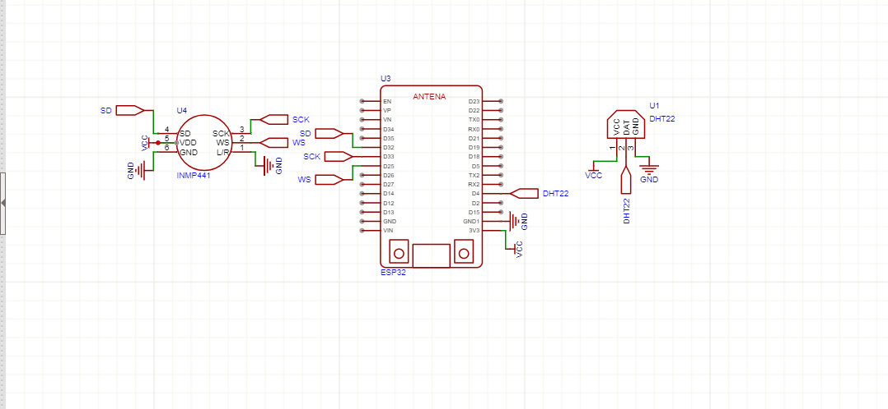
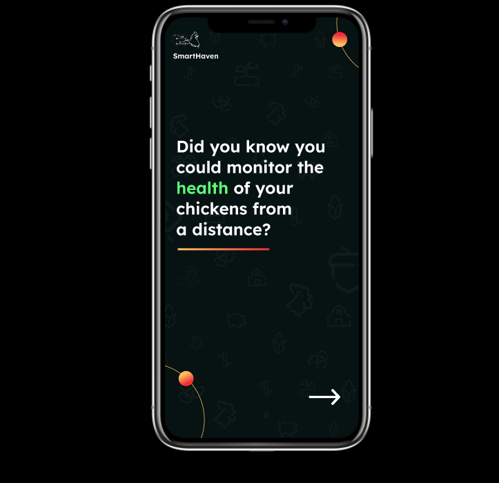
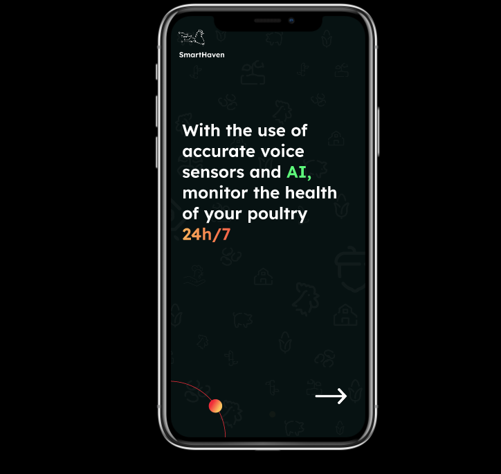
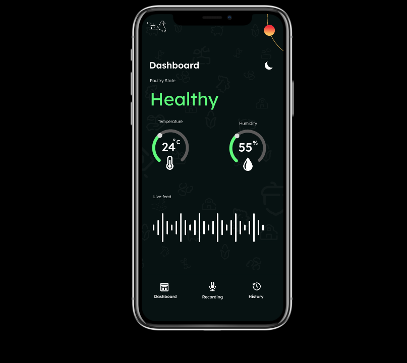
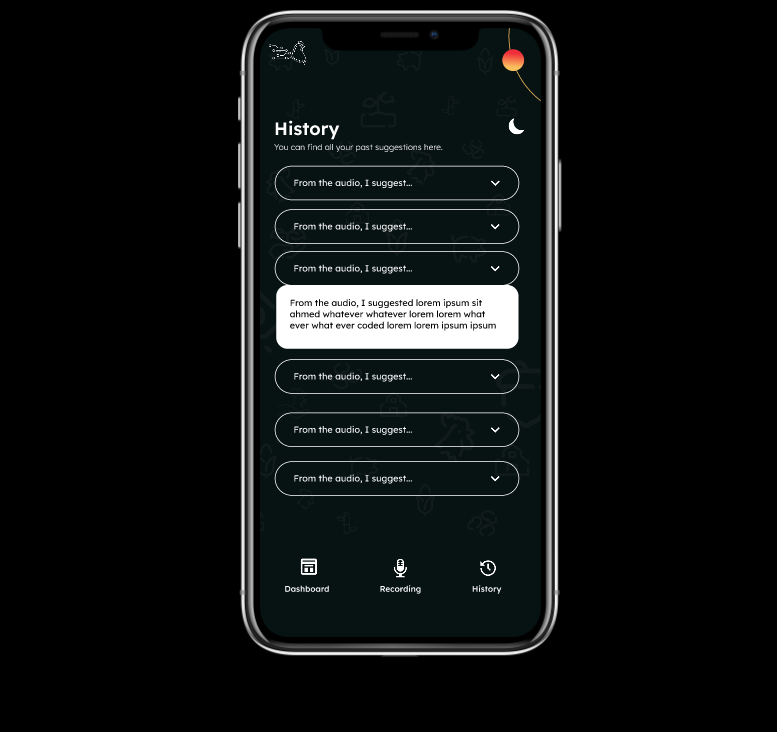

## **Project Overview:**
Smart Haven focuses on smart poultry farming using deep learning techniques to predict the health status of a chicken through vocalization analysis. The system processes audio data, converts the audio files to Mel spectrograms, trains a deep learning model, and provides real-time predictions. There's also real-time monitoring of the temperature and humidity of the poultry farm. This project aims to improve poultry monitoring, enabling early disease detection, and thus enhancing farm productivity.


## **Running the Project**

### **Prerequisites:**
- Python 3.8+

### **Installation**
To set up the environment and run the project, follow these steps:

1. Clone the repository:

```python
git clone https://github.com/Chambeline-Nkah/smart_haven.git
cd smart_haven
```

2. Navigate to the project's directory:
```python
cd smart-haven/api
```
3. Set up a virtual environment (optional but recommeded)
```python
python -m venv venv
venv\Scripts\activate
```

4. Install the required dependencies
   - Install the required Python packages from the requirements.txt file
```python
pip install -r requirements.txt
```

5. Run the main.py file on your terminal
```python
python main.py
```


## **Circuit diagram**
Below is the circuit diagram for smart haven:


## **Screenshots of the app interfaces**

1. Info about smart haven




2. Sign Up/ Login pages


3. Dashboard section


4. Recording section


5. History section



## Figma File
[Figma](https://www.figma.com/design/jM4jeLnMvGebyfmjqSRLn8/Capstone-Project?node-id=0-1&p=f&t=WiUQlnC0pmLfFiKK-0)

## Demo Video
[Demo](https://drive.google.com/file/d/1Bam0GD871M_vi7w6Y7lNlaAVoh8IP1ha/view?usp=drive_link)


## **Deployment Plan**
The model will be deployed as a real-time poultry health monitoring system, either on a cloud platform. It will process incoming audio, extract MFCC features, and classify the health status of the poultry. The temperature and humidity readings as well will be recorded through the sensors and displayed on the dashboard.Alerts will be sent to farmers via email when poultry state isn't good. The system will be continuously improved by updating the model with new data for better accuracy and performance.


## **Conclusion**
This project demonstrates the application of deep learning in poultry farming to aid in real-time monitoring of poultry, early disease detection thereby aiding in improving overall poultry health.