## **Project Overview:**
Smart Haven focuses on smart poultry farming using deep learning techniques to predict the health status of chickens through vocalization analysis. The system processes audio data, adds Gaussian noise, applies time shifting and then, converts the audio files to Mel spectrograms, which is then processed by a trained deep learning model, and provides real-time predictions. There's also real-time monitoring of the temperature and humidity of the poultry farm. This project aims to improve poultry monitoring, enabling early disease detection, and thus enhancing farm productivity.


## **Running the Project**

### **Prerequisites:**
- Python 3.8+

### **Installation**
To set up the environment and run the project, follow these steps:

1. Clone the repository:

```python
git clone https://github.com/Chambeline-Nkah/smart_haven.git
cd smart_haven
```

2. Navigate to the project's directory:
```python
cd smart-haven/api
```

3. Set up a virtual environment (optional but recommeded)
```python
python -m venv venv
venv\Scripts\activate
```


4. To run the flutter app
   
- To run the mobile app directly, do the following:
   - First, ensure you have the updated version of the flutter SDK
   - Then, install all the necessary dependencies, by running the following:
      ```python
      run flutter pub get
      ```
   - Then run the ```main.dart``` file in the ```lib``` folder.
- But in case you'll like to get the apk file instead and install it locally on your phone, run the following code:
   ```python
      flutter build apk
   ```

   or 

   - You can just click on this [link](https://drive.google.com/file/d/1l8vIMzj4hKW62ougbVst57ZlFb_MVkeI/view?usp=drive_link) to download the apk file and install it directly on your device:


## **Circuit diagram**
Below is the circuit diagram for this project:

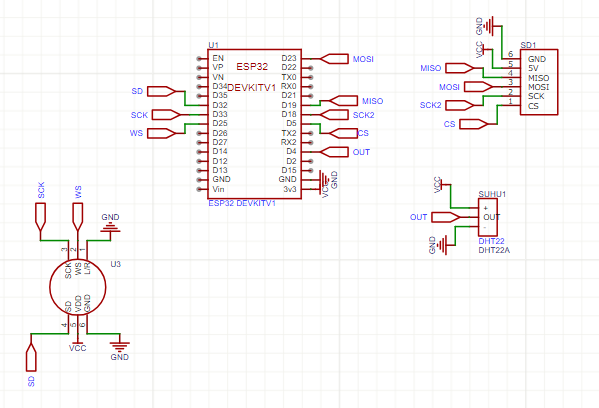

## **Screenshots of the functional app interfaces**

1. Info pages

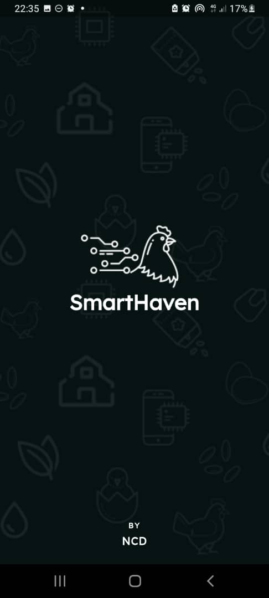
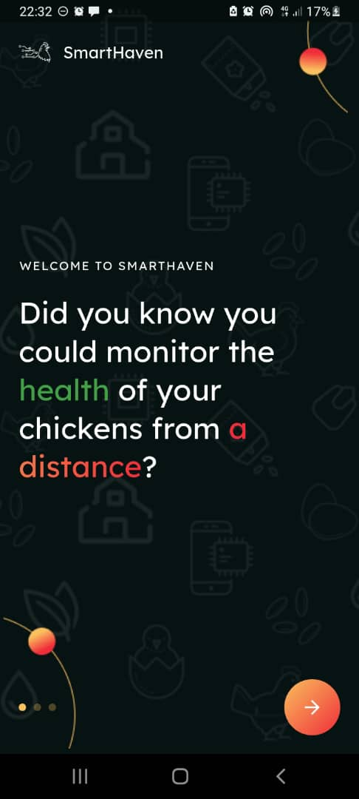
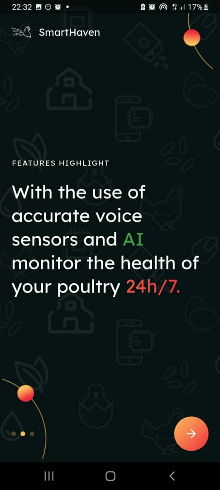
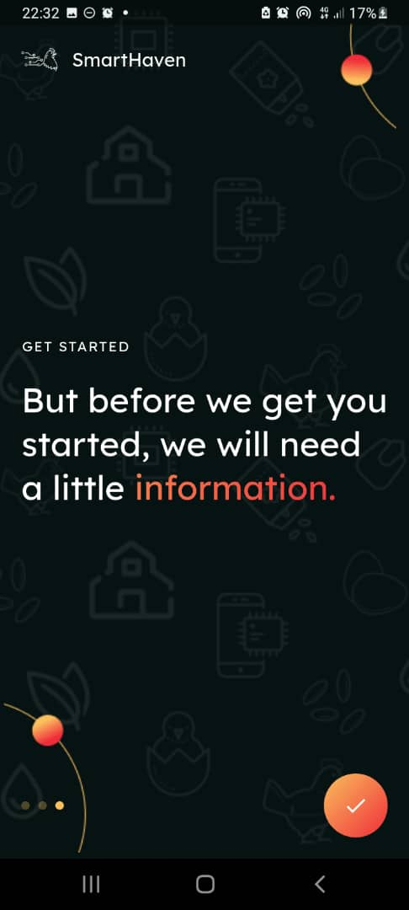

2. Sign Up/ Login pages


3. Dashboard section

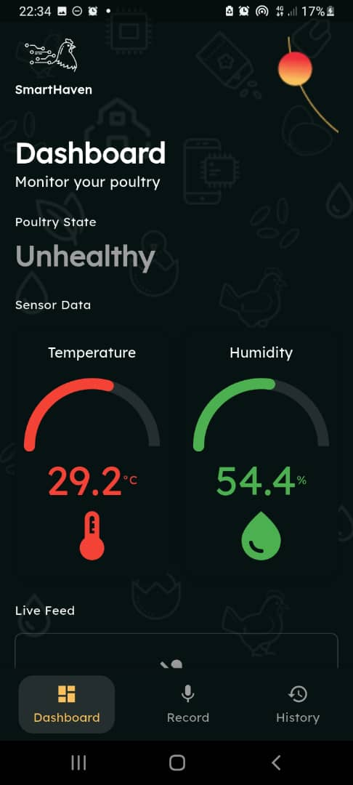


4. History section

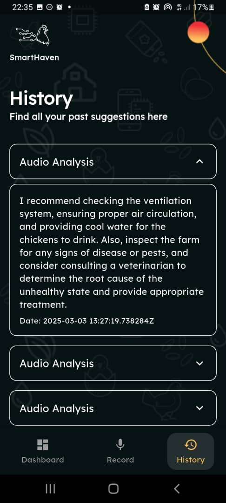


## **Different processes regarding the project**
1. Recording of the audio:

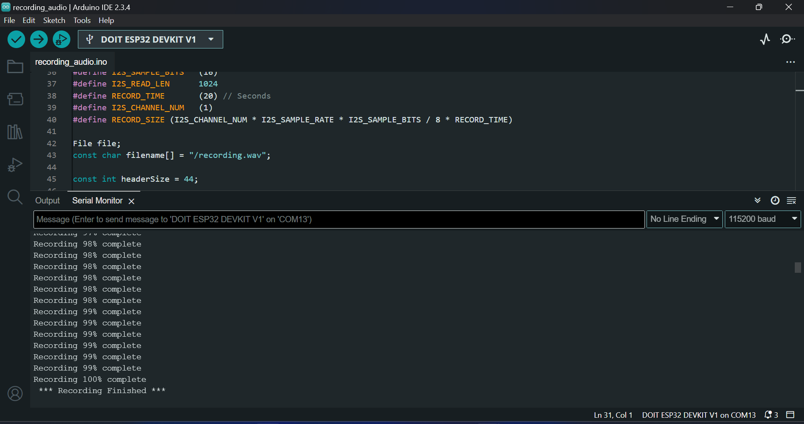

2. Sending the audio to the database:

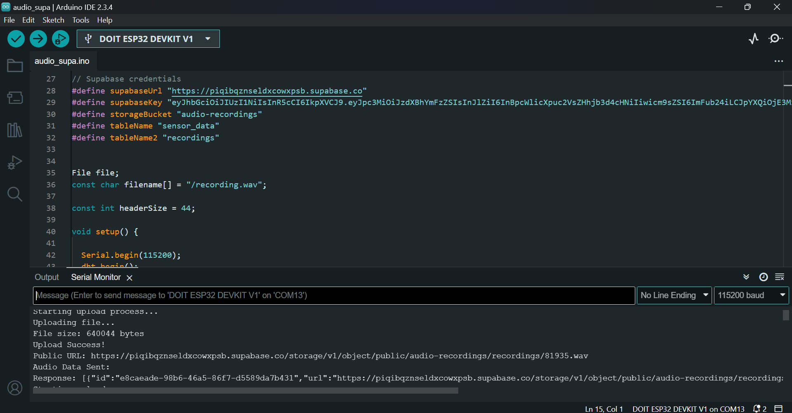


3. Audio files in the database:

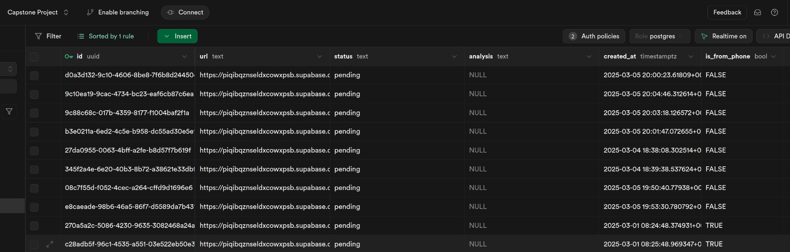


4. Recorded audio files stored in the db:


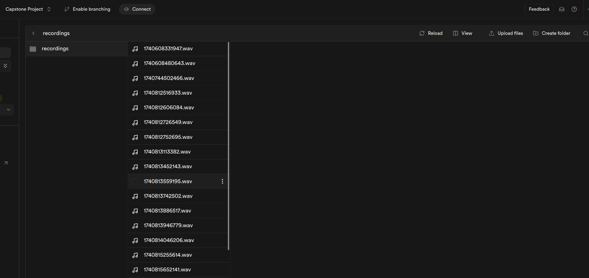


5. Sending of environmental data to db:

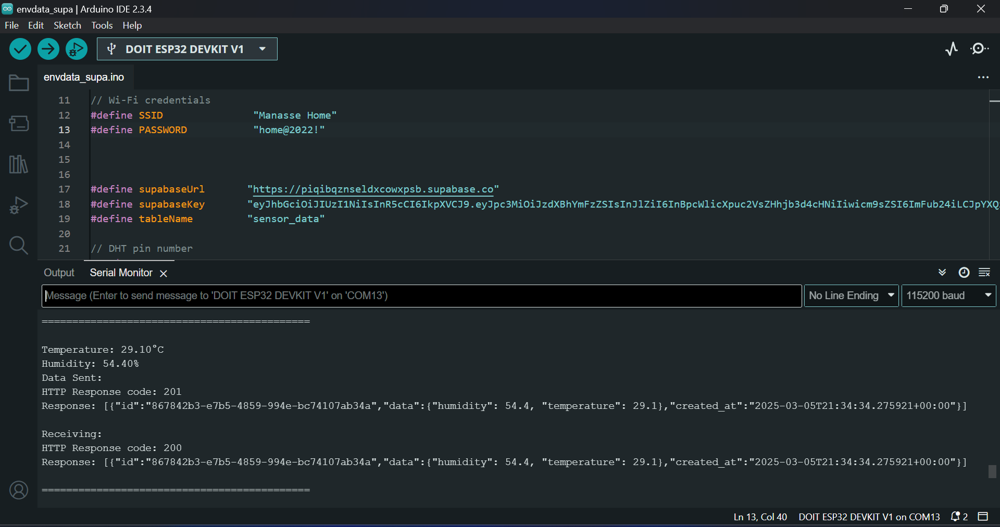


6. Temperature/Humidity in the db:

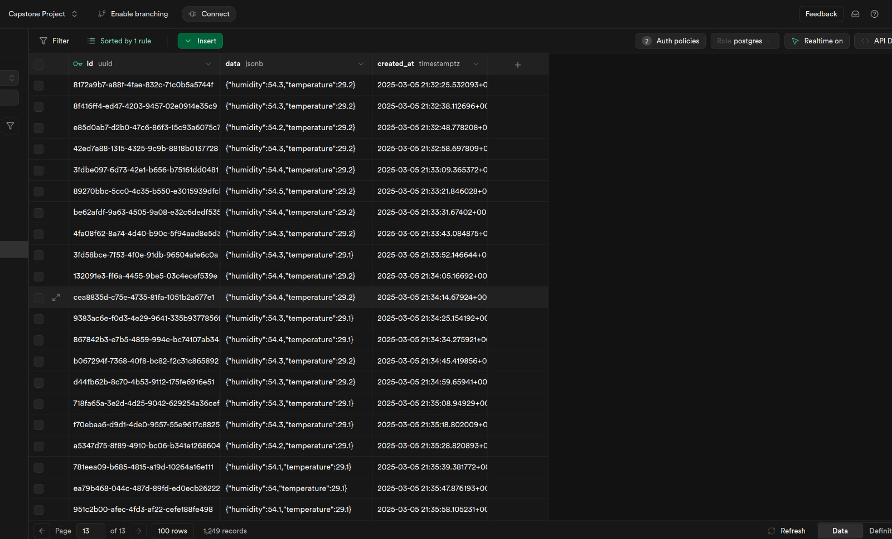


7. Predictions done by the model based on the audio data received:

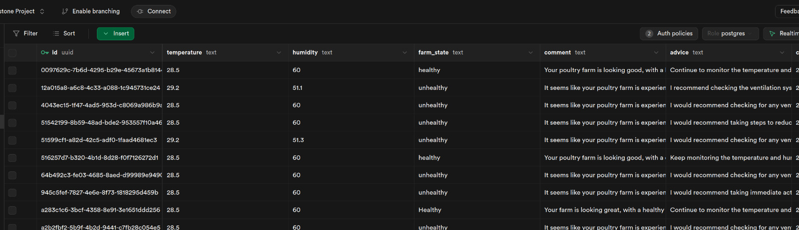


8. Email notification sent:


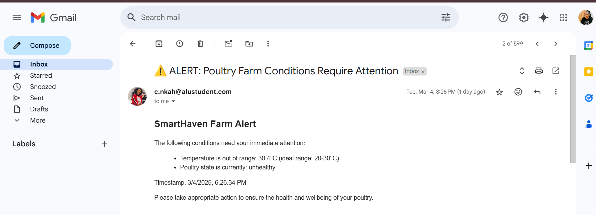


## Figma File
[Figma](https://www.figma.com/design/jM4jeLnMvGebyfmjqSRLn8/Capstone-Project?node-id=0-1&p=f&t=WiUQlnC0pmLfFiKK-0)

## Demo Video
[Demo](https://drive.google.com/file/d/1ALwtLnQmIIIDbLOMN7GpXTyVVv7JTCQt/view?usp=drive_link)


## **Deployment Plan**
The model was deployed on the Hugging Face platfom and the project was deployed in a real-time poultry farm at Nyamata. In this project, once the audio is recorded, it is converted to a MEL spectrogram, and is then processed by the model for a classification to be made. The temperature and humidity readings were recorded from the DHT22 sensor and displayed in real-time on the dashboard. Alerts were sent via email when the poultry state or the environmental conditions wren't favourable. The system is being continuously improved by updating the model with new data for better accuracy and performance.


## **Conclusion**
This project demonstrated the application of deep learning in poultry farming to aid in real-time monitoring of poultry health through early disease detection and effectively monitoring environmental conditions.